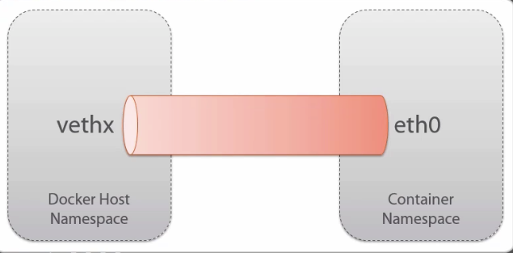

<!-- START doctoc generated TOC please keep comment here to allow auto update -->
<!-- DON'T EDIT THIS SECTION, INSTEAD RE-RUN doctoc TO UPDATE -->
**Table of Contents**  *generated with [DocToc](http://doctoc.herokuapp.com/)*

- [Docker Deep Dive](#docker-deep-dive)
  - [Major Docker Components](#major-docker-components)
    - [Images](#images)
    - [Containers](#containers)
    - [Registries and Repositories](#registries-and-repositories)
  - [Closer look at Images and Containers](#closer-look-at-images-and-containers)
    - [Image Layers](#image-layers)
    - [Union Mounts](#union-mounts)
    - [Copying Images to Other Hosts](#copying-images-to-other-hosts)
    - [Top writeable layer of containers](#top-writeable-layer-of-containers)
    - [One Process per Container](#one-process-per-container)
    - [Commands for working with Containers](#commands-for-working-with-containers)
  - [Container Management](#container-management)
    - [Starting and Stopping Containers](#starting-and-stopping-containers)
    - [PID1 and Containers](#pid1-and-containers)
    - [Deleting Containers and Images](#deleting-containers-and-images)
    - [Looking Inside of Containers](#looking-inside-of-containers)
    - [Low-level Container info](#low-level-container-info)
    - [Getting a Shell in a Container](#getting-a-shell-in-a-container)
  - [Building from a Dockerfile](#building-from-a-dockerfile)
    - [Introducing the Dockerfile](#introducing-the-dockerfile)
    - [Creating a Dockerfile](#creating-a-dockerfile)
    - [Building an Image from a Dockerfile](#building-an-image-from-a-dockerfile)
    - [Inspecting a Dockerfile from Docker Hub](#inspecting-a-dockerfile-from-docker-hub)
  - [Working with Registries](#working-with-registries)
    - [Creating a Public Repo on Docker Hub](#creating-a-public-repo-on-docker-hub)
    - [Using Our Public Repo on Docker Hub](#using-our-public-repo-on-docker-hub)
  - [Diving Deeper with Dockerfile](#diving-deeper-with-dockerfile)
    - [The Build Cache](#the-build-cache)
    - [Dockerfile and Layers](#dockerfile-and-layers)
    - [Building a Web Server Dockerfile](#building-a-web-server-dockerfile)
    - [Launching the Web Server Container](#launching-the-web-server-container)
    - [Reducing the Number of Layers in an Image](#reducing-the-number-of-layers-in-an-image)
    - [The CMD Instruction](#the-cmd-instruction)
    - [The ENTRYPOINT Instruction](#the-entrypoint-instruction)
    - [The ENV Instruction](#the-env-instruction)
    - [Volumes and the VOLUME Instruction](#volumes-and-the-volume-instruction)
      - [Host Mount](#host-mount)
      - [VOLUME Instruction](#volume-instruction)
      - [Remove Volume](#remove-volume)
  - [Docker Networking](#docker-networking)
    - [The docker0 Bridge](#the-docker0-bridge)
    - [Virtual Ethernet Interfaces](#virtual-ethernet-interfaces)
    - [Network Configuration Files](#network-configuration-files)

<!-- END doctoc generated TOC please keep comment here to allow auto update -->

# Docker Deep Dive

> Learning Docker with [Pluralsight course](https://app.pluralsight.com/library/courses/docker-deep-dive/description)

## Major Docker Components

### Images

Docker containers are launched from Docker images. i.e. image is a build-time concept, and containers are runtime.

For example, to launch an Ubuntu container and run a bash shell inside of it:

```shell
docker run -it ubuntu bash
```

`it` specifies interactive and terminal.

`ubuntu` specifies which image to base container on.

`bash` which process or application to run. Can be anything that is installed on the container.

Sample output

```
Unable to find image 'ubuntu:latest' locally
latest: Pulling from library/ubuntu
5a132a7e7af1: Pull complete
fd2731e4c50c: Pull complete
28a2f68d1120: Pull complete
a3ed95caeb02: Pull complete
Digest: sha256:4e85ebe01d056b43955250bbac22bdb8734271122e3c78d21e55ee235fc6802d
Status: Downloaded newer image for ubuntu:latest
```

`Unable to find image 'ubuntu:latest' locally` Since this is the first time an ubuntu container is being launched, don't have a local copy, therefore it gets pulled from Docker Hub, which is the public Docker registry.

`5a132a7e7af1, fd2731e4c50c, etc.` Images are comprised of multiple layers, each number represents a layer (more details later in course).

`ubuntu:latest` On Docker hub, there are many different versions of ubuntu, if a version number is not specified as part of the `run` command, then Docker will grab the image that's tagged as the `latest` version.

Docker `pull` command is used to pull images from Docker hub and install them locally. Saves time when running containers, don't have to wait for download.

To pull all versions of an image (rather than just latest which is the default)

```shell
docker pull -a ubuntu
```

To list all the images locally

```shell
docker images ubuntu
```

IMAGE ID uniquely identifies each image. Note the same image can have multiple different tags.

Docker images contain all the data and metadata required to fire up a container.

### Containers

In order to launch a container, need an image. `docker run` is used to launch a container.

`docker ps` to see a list of running images.

`docker ps -a` to see all containers that have been run on the host.

To attach to an existing running image `docker attach <containerid>`

If you're in an interactive container, can exit it without killing it by pressing Ctrl + P + Q

If you don't specify a name on the docker run command, docker will assign a name.

### Registries and Repositories

Images are pulled from _repositories_, which live inside a _registry_.

The default public registry for Docker is _Docker Hub_.

Within Docker Hub, there are many repo's, for example, the official (i.e. trusted) repos for Fedora, Ubuntu, Redis, MongoDB, etc.

Each of these repos contains different images, for example for each version such as Ubuntu 12.0.4, 14.0.4, etc.

[Browse docker hub](https://hub.docker.com/explore/)

User repos look like, for example `docker pull radial/nginx`. Be careful when pulling from a non official repo!

## Closer look at Images and Containers

### Image Layers

Images are layered (or stacked). Sometimes layers are referred to as images, which can be confusing.

For example, 3 layers stacked on top of each other, with 0 on the bottom:

```
Layer 2 (Image 2)
Layer 1 (Image 1)
Layer 0 (Image 0)
```

Together, these layer/images form a single image. i.e. a single image comprised of three layered images. An example stack of layers:

At the bottom layer, there is the _Base Image (rootfs)_. This has the root file system, which is all the files and directories required to make up a container's stripped down, bare minimum OS, for example, Ubuntu.

The next layer, _Layer 1_ could be the application layer, for example nginx. And next _Layer 2_ might have some updates or config files.

A single image can be shared by multiple containers. The layered approach allows for tweaks and updates to higher layers, without touching the base layer.

### Union Mounts

Each image or layer gets its own unique id. These id's are listed inside the Docker image, plus metadata that tells Docker how to build the container at run time. If there are any conflicts, higher layer overrides lower layer.

Image layering is accomplished through _union mounts_. The ability to mount file systems on top of each other, combining all the layers into a single view.

All of the layers in the image are mounted as read only. Then an additional layer is added when container is launched, which is the _pnly writeable_ layer.

All changes to the container at run time are committed to this top layer, via copy on write behaviour.

### Copying Images to Other Hosts

Later in the course, will use Docker Hub to push and pull images. But can also do this manually by saving container image to a tar file and exporting it.

To run a container with a short lived command (run container, run command, then process exits). This is detached mode, i.e. not using `-it` flags:

```shell
docker run ubuntu /bin/bash -c "echo 'cool content' > /tmp/cool-file"
```

This makes a _change_ to the container because it created a file. To verify, run `docker ps -a`. Sample output:

```
CONTAINER ID        IMAGE               COMMAND                  CREATED             STATUS                      PORTS               NAMES
c583c0b6afab        ubuntu              "/bin/bash -c 'echo '"   6 minutes ago       Exited (0) 35 seconds ago                       amazing_keller
bd04a65de4fd        ubuntu              "bash"                   24 hours ago        Exited (0) 24 hours ago                         agitated_goldberg
4bd18fa5121f        ubuntu              "bash"                   4 days ago          Exited (127) 3 days ago                         pedantic_stonebraker
7240d4bb88c0        hello-world         "/hello"                 4 days ago          Exited (0) 4 days ago                           insane_poitras
```

To create a new image from the changes just made to the container, where `fridge` is the name to be assigned to the image:

```shell
docker commit c583c0b6afab fridge
```

Now to  verify newly created image, run `docker images`, sample output:

```
REPOSITORY          TAG                 IMAGE ID            CREATED             SIZE
fridge              latest              6a2caa759236        8 seconds ago       188 MB
ubuntu              latest              07c86167cdc4        2 weeks ago         188 MB
hello-world         latest              690ed74de00f        5 months ago        960 B
```

To see all the commands that were used to create an image, run `docker history fridge`.

To save our newly created image:

```shell
docker save -o /tmp/fridge.tar fridge
```

To look inside the contents of the tar:

```shell
tar -tf /tmp/fridge.tar
```

To import the tar file on another machine runningDocker:

```shell
docker load -i /tmp/fridge.tar
```

### Top writeable layer of containers

Containers are run-time instances of images. When a container is launched with `docker run`, the Docker engine reads the image and any metadata, then builds the container by stacking the different image layers, as per the instructions in the image metadata.

_Each container gets its own thin writeable layer on top of the read-only image layers below it_ . All changes to a container are made in this top writeable layer, for example, installing and updating applications, writing new files, config changes like ip address. All container state is stored in this top writeable layer. This layer is initially empty, it only consumes space as changes are made to the container.

The `rootfs` of a container is never made writeable. But due to union mounts, end up with "look and feel" of a regular writeable file system.

### One Process per Container

Generally it's good practice for containers run a single app or process.

When the process running inside the container exits, so does the container. For example, run an ubuntu container in detached mode (`-d` to make it run in the background) and execute a single command (`-c` specifies the command) to ping Google's 8.8.8.8, 10 times:

```shell
docker run -d ubuntu /bin/bash -c "ping -c 10 8.8.8.8"
```

 Hitting return from above displays the container's ID. Running `docker ps` while container is still running will show the status. When container finishes running the command, `docker ps` will show nothing because there is no more active docker process running.

 To see top running processes inside a running container:

 ```shell
 docker top <containerID>
 ```

 It's good practice to be _very specific_ about which image to run. For example, instead of simply `ubuntu`, specify which version/tag like `ubuntu:14.04`. Otherwise it will download `latest` tag which could be different from today to tomorrow.

### Commands for working with Containers

Docker `run` command has many switches. For example:

* `-it` to run in interactive mode and with a shell
* `-d` to run container detached and in the background
* `--cpu-shares` to control how many cpu shares container gets (1024 is all, 256 is a quarter), by default, all containers on a host get equal access to shares.
* `memory=1g` to specify how much memory to allocate to container, for example 1g.

To get detailed information about a container:

```shell
docker inspect <containerID>
```

## Container Management

### Starting and Stopping Containers

Containers can be started, stopped, and restarted. Under the hood, containers are a linux process running on the host.

To stop a container from the host:

```shell
docker stop <containerID>
```

The stop command sends a `SIGTERM` signal to the process with PID1 running inside of the container. The process running in the container can gracefully terminate.

Can also do `docker kill -s <SIGNAL> <containerID>` which sends a `SIGKILL` signal. Brute force, non graceful way to terminate.

To see the last container that has run on the host:

```shell
docker ps -l
```

It can be restarted with:

```shell
docker start <containerID>
```

Note that `docker attach` attaches to process with PID1 inside the container.

### PID1 and Containers

PID1 is the process running in the container that was specified at the end of the docker run command `docker run <command>`.

In the simple examples above, has been `bin/bash`, but usually would be a command to start an app daemon.

Note that PID1 is _not_ the usual `init` Linux process (which all other processes are forked from, and when it receives a terminate signal, it gracefully shuts down all its child processes). So when the Docker container PID1 receives a kill signal, it shuts itself down, but will NOT shut down any other processes running on the container. And that is why its best practice to only run a single process per container.

However, may also want other processes like syslog, cron, etc. See `phusion/baseimage` for doing this properly within Docker.

### Deleting Containers and Images

To see how many containers and images are stored on the host:

```shell
docker info
```

To remove (i.e. delete) a container:

```shell
docker rm <containerID>
```

Note this will not work for removing a _running_ container, unless its forced with `-f` flag, or `stop` the container first.

To delete an image, first need to delete any containers that are linked to that image, use `docker ps -a` to find these.

Then an image can be deleted with `docker rmi <Image ID>`.

Can delete multiple containers or images at once by providing a space separated list of ID's.

### Looking Inside of Containers

`docker top <containerID>` can be run from the host, to see processes running inside the container.

`docker logs <containerID>` will show any logs from container. Can also supply `-f` or `--follow` to docker logs command to keep streaming new log messages, similar to linux `tail` command.

### Low-level Container info

`docker inspect <containerID|imageID>` provides detailed information about a container or image. Including "State" such as its current status, when it was started etc, networking info like IP address.

Behind the scenes, this information is pulled together from several json files, config.json and hostconfig.json.

### Getting a Shell in a Container

`docker attach` attaches to PID 1 inside the container, which is fine if PID 1 is a shell. But that's not very common in the real world.

So how else to get a shell? There's `ssh` but running that in a container is generally frowned upon.

One option is `nsenter` to entering a namespace. First requires PID of container on the host. Can get that from `docker inspect`:

```shell
docker inspect <containerID> | grep Pid
nsenter -m -u -n -p -i -t <pid> /bin/bash
```

* `-m` mount namespace
* `-u` uts namespace
* `-n` network namespace
* `-p` process namespace
* `-i` ipc namespace
* `-t` target

nsenter may not be installed by default, to install it:

```shell
docker run -v /usr/local/bin:/target jpetazzo/nsenter
```

Recommended:

```shell
docker exec -it <containerID|name> bash
```

## Building from a Dockerfile

### Introducing the Dockerfile

Plain text file has to be named exactly "Dockerfile". Its comprised of instructions for how to build an image, that get read one at a time from top to bottom.

### Creating a Dockerfile

[Example](dockerfile-intro/Dockerfile)

Lines starting with hash "#" are comments.

`FROM` must be first instruction in Dockerfile. Specifies which image this image will be based on.

Next line should be `MAINTAINER`. This can go anywhere in the file, but its good practice to put it at the top.

`RUN` instructions are used to run commands against the image that is being built, for example, to install software packages.

Every `RUN` instruction _adds a layer_ to the image. For example, suppose a Dockerfile has:

```ruby
RUN apt-get update
RUN apt-get install -y nginx
RUN apt-get install -y golang
```

This would result in an image with 3 layers. First RUN instruction would create a container, execute the command `apt-get update`, stop the container and commit the change to a new image layer. Next RUN instruction launches a new container from the new image layer just committed, executes `apt-get install -y nginx`, stops the container, and commits its new layer. And so on for every RUN command.

Then `CMD` specifies a command to run anytime a container is launched from this image, for example:

```ruby
CMD ["echo", "Hello World"]
```

### Building an Image from a Dockerfile

To build an image from a Dockerfile, from the directory in which the Dockerfile is located:

```shell
docker build -t helloworld:0.1 .
```

`-t` to apply a tag to the image, not required, but highly recommended.

`.` indicates this directory.

When the build command is run, the Docker daemon steps through each instruction in Dockerfile. For example:

```
Step 1 : FROM phusion/baseimage:0.9.15
 ---> 4cb79d39875e
Step 2 : MAINTAINER developer@foo.test
 ---> Running in 4a5338caecdf
 ---> 52bda3555ffb
 Removing intermediate container 4a5338caecdf
```

Detailed analysis of Step 2:
1. Spins up an (intermediate) container with id `4a5338caecdf`
1. Runs the MAINTAINER command
1. Commits a new image layer with id `52bda3555ffb`
1. Removes intermediate container `4a5338caecdf`

This sequence of steps is repeated for each instruction in the Dockerfile.

Note its the _container_ that gets thrown away at each step, NOT the image layers, those are kept.

Last line of build output is something like `Successfully built bde721e98ca0`, where `bde...` is the newly created Image ID. Run `docker images` to see this.

To see the history of a docker image:

```shell
docker history <Image ID>
```

To run a container from the newly created image:

```shell
docker run helloworld:0.1
```

### Inspecting a Dockerfile from Docker Hub

Browse repos on [Docker Hub](https://hub.docker.com/explore/), for example [Ubuntu](https://hub.docker.com/_/ubuntu/).

Can click on any of the image version links to get to the Dockerfile for that image:tag. For example [Ubuntu 14.0.4](https://github.com/tianon/docker-brew-ubuntu-core/blob/fae14e72201e4411a7e04c70150238dc79242b29/trusty/Dockerfile).

This image uses a very long RUN command to avoid having many layers in the image, for example:

```
RUN set -xe \
	\
	&& echo '#!/bin/sh' > /usr/sbin/policy-rc.d \
	&& echo 'exit 101' >> /usr/sbin/policy-rc.d \
	&& chmod +x /usr/sbin/policy-rc.d \
  ...
```

## Working with Registries

### Creating a Public Repo on Docker Hub

In order to push an image to Docker Hub, need to create a Docker account.

Note that when adding a repo, can mark it as Public or Private. However, you only get one _free_ private repo.

After a repo is created on Docker Hub, to push to it, first need to tag the Image ID with the namespaced name, then can push it, for example:

```shell
docker tag 33bd6fec7f67 danielabar/helloworld:0.0.3
docker push danielabar/helloworld:0.0.3
```

Note: First time, need to run `docker login` to authenticate.

### Using Our Public Repo on Docker Hub

```shell
docker pull danielabar/helloworld:0.0.3
```

## Diving Deeper with Dockerfile

### The Build Cache

The first time you build an image, it will take some noticeable amount of time to build all the layers. But building a second time, even if update the tag, its very fast because it uses the _build cache_.

When an image is built, the Docker daemon iterates through the Dockerfile, executing each instruction. As each instruction is executed, daemon checks to see if it already has an image for that instruction in its build cache.

The daemon starts from base image, then looks at all child images associated (i.e. linked) with that base image, and it checks to see if any of them were built with the same instruction as the current instruction being processed. If yes, then the daemon can use the image from the cache and creates a new link.

### Dockerfile and Layers

[Example](dockerfile-layers/Dockerfile)

When built, this image will consist of 6 layers. To understand how this happened, run `docker history <Image ID>`. This lists events in reverse order to the instructions in Dockerfile. Each one is a layer:

```
IMAGE               CREATED             CREATED BY                                      SIZE                COMMENT
f3fb495c13d0        6 minutes ago       /bin/sh -c #(nop) CMD ["echo" "Hello World"]    0 B
f5f16f45412c        6 minutes ago       /bin/sh -c apt-get install -y golang            174.5 MB
ef09eeb76b57        6 minutes ago       /bin/sh -c apt-get install -y vim               43.27 MB
199db7d6388e        7 minutes ago       /bin/sh -c apt-get install -y apache2           14.38 MB
2d475219289a        7 minutes ago       /bin/sh -c apt-get update                       21.67 MB
37df496aaa6f        7 minutes ago       /bin/sh -c #(nop) MAINTAINER test@test.test     0 B
97434d46f197        6 days ago          /bin/sh -c #(nop) CMD ["/bin/bash"]             0 B
<missing>           6 days ago          /bin/sh -c sed -i 's/^#\s*\(deb.*universe\)$/   1.895 kB
<missing>           6 days ago          /bin/sh -c set -xe   && echo '#!/bin/sh' > /u   194.5 kB
<missing>           6 days ago          /bin/sh -c #(nop) ADD file:e01d51d39ea04c8efb   187.8 MB
```

Our image layers start at `MAINTAINER` line and moving upwards. Those below come from the base image (ubuntu:14.04 in this case). So MAINTAINER instructions + 4 apt-get's + CMD = 6 image layers.

Most instructions issued in a Dockerfile result in a new image layer being created.

### Building a Web Server Dockerfile

[Example](dockerfile-web/Dockerfile)

To expose a port, use `EXPOSE` instruction, for example:

```ruby
EXPOSE 80
```

This ensures that port 80 in any containers that spin up from this image, is available to the Docker host its running on.

```shell
docker build -t danielabar/apache-webserver:0.0.1 .
```

### Launching the Web Server Container

```shell
docker run -d -p 80:80 danielabar/apache-webserver:0.0.1
```

`-p 80:80` specifies to map port 80 on host to 80 on container.

To test that it's working, first get the IP address of the docker machine:

```shell
192.168.99.100
```

Then enter that in a browser, expect the Apache2 Ubuntu Default Page.

### Reducing the Number of Layers in an Image

Solution is to have a single RUN instruction with multiple instructions joined by `&&`. Also makes the image size smaller. For example, going from this:

```ruby
RUN apt-get update
RUN apt-get install -y apache2
RUN apt-get install -y apache2-utils
RUN apt-get install -y vim
RUN apt-get clean
```

to this:

```ruby
RUN apt-get update && apt-get install -y \
  apache2 \
  apache2-utils \
  vim \
  && apt-get clean \
  && rm -rf /var/lib/apt/lists/* /tmp/* /var/tmp/*
```

Results in a smaller image:

```
REPOSITORY                    TAG                 IMAGE ID            CREATED             SIZE
danielabar/apache-webserver   0.0.2               7963f7d10879        7 minutes ago       300.2 MB
danielabar/apache-webserver   0.0.1               b5776bd68cde        46 hours ago        323.4 MB
```

### The CMD Instruction

Similar to `RUN` in that it executes commands, but its also very different:

* Only executes at run-time, i.e. when a container is launched, whereas `RUN` is a build-time instruction.
* `RUN` adds layers to images and is commonly used to install apps (eg: `apt-get install...`).
* `CMD` runs a command in the container when its launched.
* `CMD` is equivalent of `<command>` that can be added at end of `docker run`, i.e. `docker run <args> <command>`.
* Commonly used to start applications on PID1 inside a container (eg: Apache, MongoDB, Redis etc.).
* Note that if a `<command>` is specified on the `docker run` CLI, this overrides any `CMD` in the Dockerfile.
* There can only be one `CMD` per Dockerfile

CMD takes two input styles:

__Shell Form:__ Takes the commands, arguments, variables, etc and treats them exactly the same way they'd be treated by the shell itself. If arguments are specified in this form, they get automatically prepended with `/bin/sh -c`

For example if Dockerfile has:

```ruby
CMD echo $var1
```

Then the variable would get expanded, just like it would in a shell (assuming a variable had been passed in, will be shown how to do this later in the course).

__Exec Form:__ _This is the recommended style_. Arguments are passed to CMD formatted as a JSON array, i.e comma separated list of values, enclosed in double quotes `["command", "arg1"]`.

This form allows commands to be executed inside containers that don't have a shell. Avoids string munging by shell. But no shell features such as variable expansion, and shell chars such as `&&`, `||`, `>`, ...

### The ENTRYPOINT Instruction

[Example](docker-entry/Dockerfile)

Preferred method for specifying default app to run inside a container is with `ENTRYPOINT` instruction. Advantages over `CMD`:

* Can't be overridden at run-time with commands `dockek run ... <command>`.
* Any command at run-time gets interpreted as _arguments_ to `ENTRYPOINT`.
* A single image's containers can have different behaviours by passing different arguments to entrypoint.

For example, given a Dockerfile containing:

```ruby
ENTRYPOINT ["echo"]
```

Build:

```shell
docker build -t danielabar/entry-example:0.0.1 .
```

Run with arguments:

```shell
docker run danielabar/entry-example:0.0.1 Helooooo0 there!
```

Outputs:

```
Helooooo0 there!
```

What happened? String at end of run command "Helooooo0 there!" got passed to `ENTRYPOINT ["echo"]` as argument.

Note: If try to run the container in interactive mode and get a shell:

```shell
docker run -it danielabar/entry-example:0.0.1 /bin/bash
```

What actually happens is "/bin/bash" gets interpreted as an argument to `echo` ENTRYPOINT, so it will just display "/bin/bash" and you won't get into the container, because it will immediately exist after it finishes processing echo.

Using `ENTRYPOINT` makes the container behave like a binary. In the above simple example, the container is behaving like the `echo` binary.

A more realistic example, Dockerfile:

```ruby
FROM phusion/baseimage:0.9.15
MAINTAINER test@test.test
RUN apt-get update && apt-get install -y iputils-ping apache2
ENTRYPOINT ["apache2ctl"]
```

Build:

```shell
docker build -t danielabar/entry-example:0.0.2 .
```

Run passing in args to `apache2ctl`:

```shell
docker run -d -p 80:80 danielabar/entry-example:0.0.2 -D FOREGROUND
```

To verify, run `docker ps` and see the COMMAND being used:

```
CONTAINER ID        IMAGE                            COMMAND                  CREATED             STATUS              PORTS                NAMES
8a9f5da91a95        danielabar/entry-example:0.0.2   "apache2ctl -D FOREGR"   2 minutes ago       Up 2 minutes        0.0.0.0:80->80/tcp   thirsty_knuth
```

Additional Notes:

* If both `CMD` and `ENTRYPOINT` instructions are specified in a Dockerfile, the `CMD` instructions also get interpreted as arguments, _if_ they're specified in exec form. Also recall `CMD` in Dockerfile is overridden by `docker run ... <command>`. This can be useful in specifying default arguments in Dockerfile as `CMD`, then have ability to _override_ at runtime using CLI.
* `ENTRYPOINT` in Dockerfile can be overridden at docker run CLI with `--entrypoint` flag.

### The ENV Instruction

[Example](docker-env/Dockerfile)

Used to pass environment variables to containers. Looks like `ENV var=value`. Then `var` is available inside the container as a regular environment variable.

Multiple variables can be defined on the same line, space separated. Otherwise if use multiple ENV instructions, each creates another image layer.

Build the image, run a container from it, then check the environment variables:

```shell
$ docker build -t danielabar/docker-env:0.0.1 .
$ docker run -it danielabar/docker-env:0.0.1 /bin/bash
root@<containerid>:/# env
```

Can also use env vars in context of Dockerfile. For example:

```ruby
ENV var3=echo var4=hellooooo
CMD $var3 $var4
```

Build and run it in detached mode, then inspect the logs to verify it ran the echo command with 'hellooooo'.

```shell
$ docker build -t danielabar/docker-env:0.0.2 .
$ docker run -d danielabar/docker-env:0.0.2
$ docker logs <containerid>
```

In the case of a long running command, can also follow the logs with `docker logs -f <containerid | name>`

### Volumes and the VOLUME Instruction

Volumes support decoupling data and volumes from containers. Can also be used to share data between containers.

Specify a directory or mount point within a container and store any data _written_ to that location, _outside_ the container's union file system. i.e. store the data in a directory on the Docker host's file system.

This way, if the container gets stopped or deleted, the data persists, because it's _decoupled_ from the container.

Example:

```shell
docker run -it -v /test-vol --name=volumetest ubuntu:15.04 /bin/bash
```

Running `ls -l` from inside container, will see the `test-vol` directory, which Docker created as part of container creation. Note that `test-vol` doesn't have to already exist, but if it does, then normal unix mount rules apply. Any data that already exists in the mount point becomes unavailable while there's a volume mounted in it.

Create a text file in the container `test-vol/testfile`, save it, then exit container with Ctrl P Q.
(not sure where on Mac with Docker Toolbox volumes go).

Other containers can share this volume using `volumes-from` flag:

```shell
docker run -it --volumes-from=volumetest --name=volumetest2  ubuntu:15.04 /bin/bash
```

Running `ls -l` in this container will see the `test-vol` directory with `testfile` in it.

This volume is accessible to other containers, even if the original container that created it is stopped or deleted.

#### Host Mount

A directory can also be mounted from Docker host into a container, this is called a _host mount_. For example, might have a shared data directory on the Docker host, and want to bind mount it to every container launched on the host.

```shell
docker run -it -v /host-data:/container-data
```

This will mount `host-data` directory on Docker host to a mount point called `container-data` inside of the container.

#### VOLUME Instruction

Can also use the `VOLUME` instruction in a Dockerfile. For example:

```ruby
VOLUME /data
```

This will `data` directory in any containers launched from images built with this Dockerfile store their data in the Docker host's file system.

Note: VOLUME instruction in Dockerfile does not support host mount.

#### Remove Volume

To delete a volume, delete it within its container:

```shell
docker rm -v <containerID>
```

If the container is deleted without specifying `-v`, then the volume does not get deleted.

## Docker Networking

### The docker0 Bridge

When the Docker daemon starts on the Docker host, it creates a `docker0` bridge (virtual switch), created entirely in software. `docker0` is crucial to container networking. Just like a regular physical switch, it passes packets between connected devices. Normal switches have ports and devices attached to them. `bridge-utils` can be used to see what's connected to `docker0` (linux only).

### Virtual Ethernet Interfaces

Using this [Dockerfile](docker-net/Dockerfile), build, then launch two containers, for each one run interactive to keep the shell going, then Ctrl+P+Q to jump out:

```shell
docker build -t net-img .
docker run -it --name=net1 net-img
docker run -it --name=net2 net-img
```

Each new container gets one interface automatically attached to the `docker0` virtual bridge.

From inside container, run `ip a` to look at network configuration. The `eth0` adapter is on the 172.17 network.
When the Docker damon starts on the Docker host and creates the `docker0` bridge, it assigns it an IP address as defined in RFC1918. It picks a network that isn't already in use. By default, should be able to communicate out, for example `ping 8.8.8.8`.

Can also determine the container's default gateway by running `traceroute 8.8.8.8`. The first entry is the default gateway. It's the address of the `docker0` interface on the Docker host.

`eth0` in the container is connected to `vethx` interface on the Docker host (the interface that is automatically attached to `docker0`). They're like two ends of a pipe, where one is in the namespace of the docker host, and the other in the namespace of the container. Whatever goes into one end of the pipe pops out the other end.



### Network Configuration Files
